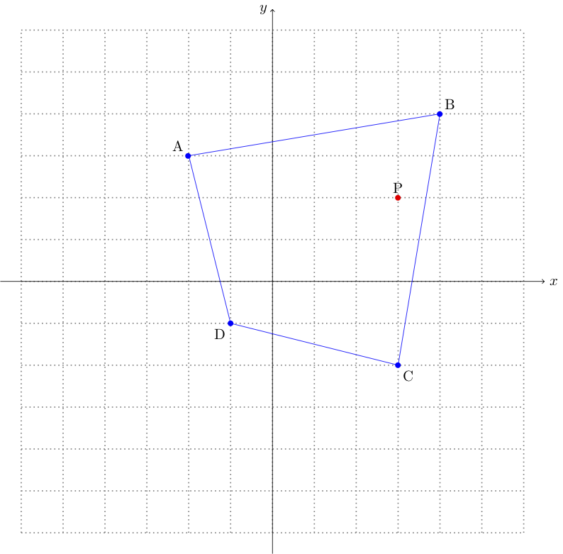
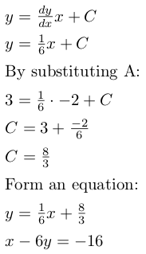
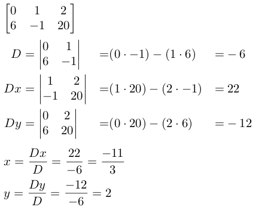

# picket

picket is a library that uses coordinate geometry to calculate whether a given point is inside a fence made from several other points. It treats the latitude/longitude system as a coordinate grid to do this, with North & East as positive axes and South & West as negative axes. Points must be provided in decimal lat/long form, but a conversion method is available for values in Degrees, Minutes, and Seconds (DMS).

## The Maths.

picket uses various pieces of coordinate geometry maths to perform its calculations. This is probably best explained using a worked example.

Point to be checked (P) = `(3, 2)`.  
Points that form the fence (in order) (ABCD) = `[(-2, 3), (4, 4), (3, -2), (-1, -1)]`.

*Figure 1*

As you can see in *Figure 1*, the fence is shown in blue and the point to be checked in shown in red. The point is clearly within the fence, but for a computer it's not quite that easy.  

It is possible to programatically determine if a point is within a polygon using ray casting. A ray cast in any direction from the point will intersect with the polygon an odd number of times if it is within the polygon, and an even amount of times if it is not. As such, picket first forms a line equation from the point to be checked that will be used as the ray. I've chosen to use a horizontal line, but a line of any gradient will work so long as it passes through the point.

*Figure 2*

As you can see in *Figure 2*, the line drawn through the point (the point horizon line) intersects with the fence once in each direction from the point. Hence, a ray cast from the point in a positive x direction will intersect with the fence once, and a ray cast in a negative x direction will intersect with the fence once. This asserts that the point is within the fence polygon because a ray cast in either direction intersects with the polygon an odd number of times.

However, a computer cannot just *see* that the lines intersect, this must be calculated. This is done using some simple coordinate geometry.

First, the equations of the lines that form the fence are calculated. The polygon is separated into pairs of points: `(A, B), (B, C), (C, D), (D, A)`, each pair forms a line that makes up part of the fence. For each pair of points, the gradient is found. Taking `(A, B)` as an example:

  

*Figures 3 & 4*

Once the gradient of the line has been calculated, the equation of the line can be found as follows:

  

*Figure 5*

This is repeated for each pair of points.

Once the line equations of each side of the polygon have been found, we can find the intersects between them and the point horizon line. All pairs of line equations will have an intersect unless they are parallel, and so just counting the number of intersects cannot be relied upon to prove that the point is/is not within the fence polygon. picket deals with this problem by performing a check to ensure that the point of intersection is within the area bound by the points that form the fence segment of the line that is being checked. Bearing this in mind, we can proceed to calculate the intersects between the point horizon line and the polygon fence.

The point at which 2 linear equations (straight lines) intersect can be calculated by solving these equations simultaneously, using Cramer's rule. From Figure 2 we can see that the point horizon line intersects with lines `BC` and `DA`, for this example we will be using line `BC`, follow the above steps to find the equation for it.

*Figure 6*

In very simplified terms, Cramer's rule calculates the solutions to a system by finding the determinant of the matrix formed by the x&y coefficients (`D`), the determinant of the matrix formed by the y coefficient and the right-hand-side (`Dx`), and the determinant of the matrix formed by the x coefficient and the right-hand-side (`Dy`). Once these have been found, the solutions x and y can be found by calculated by `Dx/D` and `Dy/D`:

*Figure 7*

A much more detailed step by step explanation of Cramer's rule can be found on [Wolfram Mathworld](http://mathworld.wolfram.com/CramersRule.html).  

If the determinant `D` is equal to 0, then the equations do not intersect (with linear equations this essentially means that the lines are parallel). picket checks if the determinant is 0, and if it isn't calculates the point of intersection, and adds it to one of two lists depending if the point is more or less x-positive than the point being checked.

Once all points of intersection have been calculated, picket will have formed 2 lists: a list of points less x-positive than (to the left of) the point being checked, and a list of points more x-positive than (to the right of) the point being checked. if the length of both of these lists is an odd number, then the point can be asserted to be within the bounds of the polygon fence.